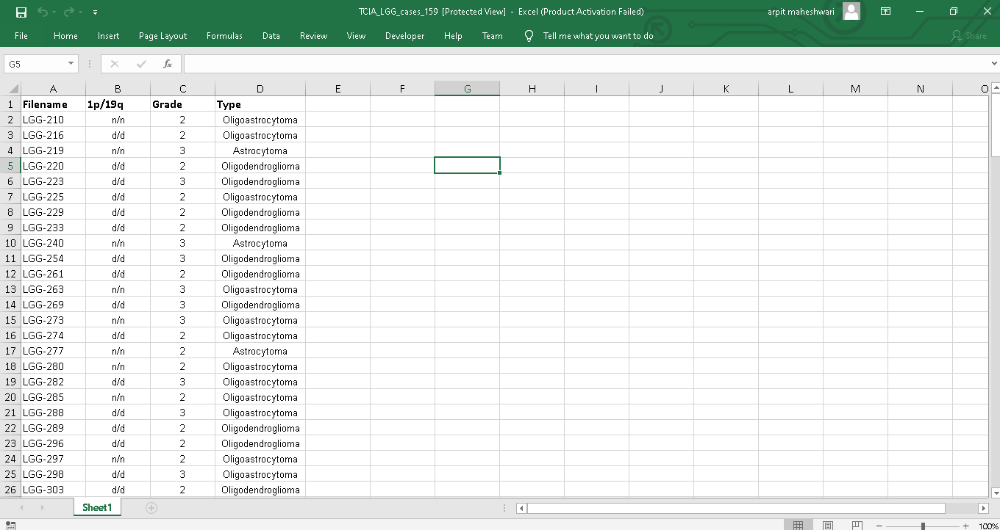
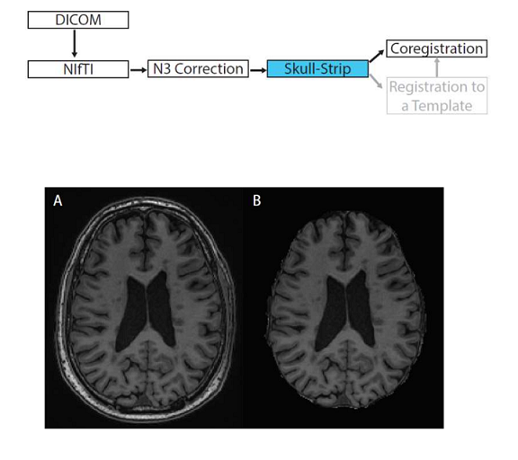
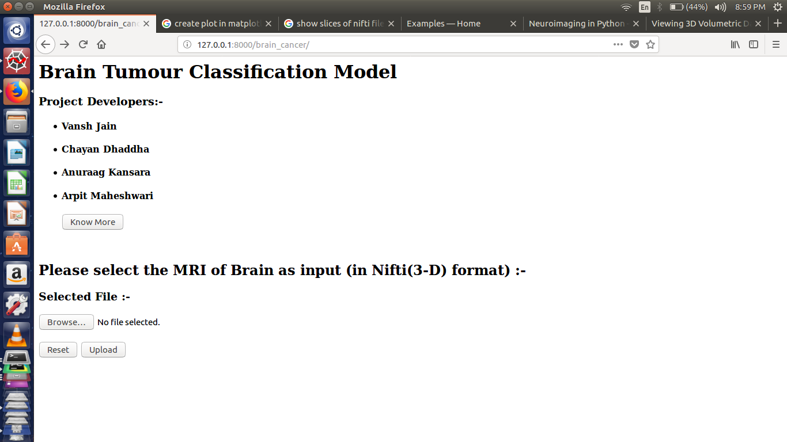
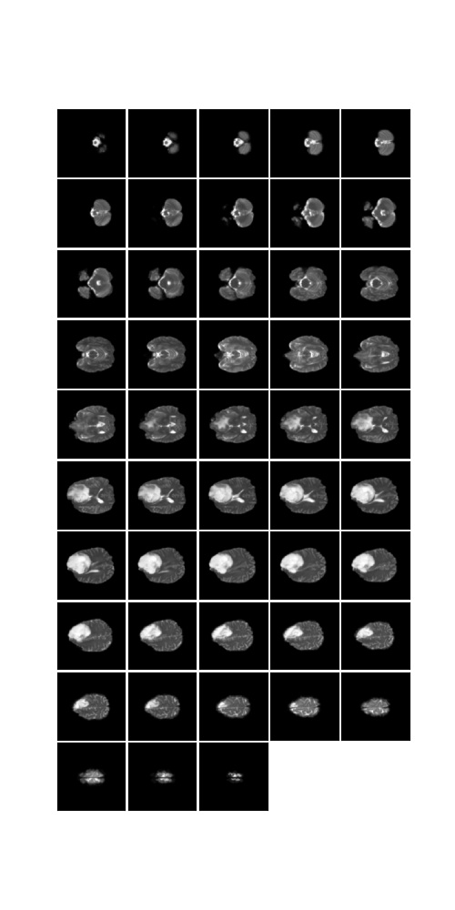
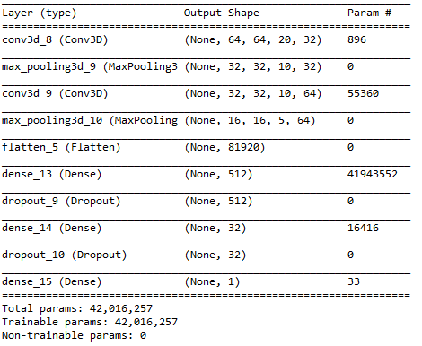

# Epitome-Extraction-and-Tumour-Classification-from-MRIs-of-Brain 
The project is to design a simple open-source scripted software that depends on a minimum no. of software platforms and is dedicated to the diagnosis of a disease by extracting epitomes from the medical image. It is also presented at Smart India Hackathon 2018 developed in Feb-Apr 2018.

A CNN based model for medical 3D NIfTI MRI of the brain. Firstly, an image preprocessing pipeline is developed in which Skull Strapping, Inhomogeneity Correction, and Registration are done on MRIs. The processed images are fed into a Convolutional Neural Network which extracts features from them. Then 3D CNN model was built on the preprocessed images using Keras. These features are used as an input to an Artificial Neural Network which classifies the grade of disease i.e. malignant or benign. Finally, the epitome of the tumor was extracted from MRIs and the size of the tumor is also predicted. 

The trained model was big in size (480 MB), so can be downloaded from assets of release v1.0 and copy it in `/tumour_detection/lib/` and then can run the project.
Or otherwise you can build a model and save it using the functions written in `/tumour_detection/lib/` files.
##### For more details look into references and project report `TumorClassificationFinalReport.pdf`
### Technology Stack:
* Python
* R
* Convolutional Neural Networks
* HTML, CSS, Django
* FSL Library
* Keras and OpenCV

### Dataset used 
The dataset is taken from TCIA collections, cancerimagingarchive.net. TCIA is a service which
de-identifies and hosts a large archive of medical images of cancer accessible for public
download. The data are organized as “Collections”, typically patients related by a common
disease (e.g. lung cancer), image modality (MRI, CT, etc) or research focus. DICOM is the
primary file format used by TCIA for image storage. Supporting data related to the images such
as patient outcomes, treatment details, genomics, pathology, and expert analyses are also
provided when available.

The MRIs used in this project are pre-operative examinations performed in 159 subjects with
Low Grade Gliomas (WHO grade II & III). Segmentation of tumors in three axial slices that
include the one with the largest tumor diameter and ones below and above are provided in
NiFTI format. Tumor grade and histologic type are also available. All of these subjects have
biopsy proven 1p19q results, performed using FISH. For the 1p/19q status "n/n" means neither
1p nor 19q were deleted. "d/d" means 1p and 19q are co-deleted. 

* Image Size (GB) 2.7
* Modalities MRI, SEG, NIfTI
* Number of Images 17360
* Number of patients 159
* Number of Series 319
* Number of studies 160

### Some screenshots from the project 
#### Details in excel about NIFTI images dataset

#### Steps in Preprocessing pipeline

#### Simple Interface created in Django

#### Slices of Preprocessed images containing white tumor cells

#### Initital DFD for project

#### Final layers used in CNN

### Conclusion
It was found that the methods used can improve the classification of different grades of Glioma in patients. These methods can be integrated in one methodology that is capable of significantly improve the classification problem at hand. Using a balancing training data prevents bias during classifier training. Feature ranking has not a direct effect on improving the classification task, though it can reduce the search time in the feature selection step. Feature selection hits two birds with one stone. First, it reduces the future training process by selecting an optimal subset of features. Second, it improves the accuracy by eliminating irrelevant and redundant features. Despite it the model was able to attain a accuracy on test data about 70% only. The reason is dataset was of medium size with only 159 patients data and the resources available for modelling are also limited. Finally, the model have scope for improvement but needs a large dataset with enough resources to build a highly scalable and genralized model with accuracy nearing 95%. 

### References:
1. Deep Learning A-Z course on Udemy.com
2. Cancer Imaging Archive, www.cancerimagingarchivearchive.net
3. Magnetic Resonance Contrast Prediction Using Deep Learning, Cagan Alkan, John Cocjin, Andrew Weitz, http://cs231n.stanford.edu/reports/2017/pdfs/530.pdf
4. Neurohacking in R course on Coursera.com, https://www.coursera.org/learn/neurohacking
5. Kaggle, pythonprogramming.net 
6. FSL Library, https://fsl.fmrib.ox.ac.uk/fsl/fslwiki
7. https://www.youtube.com/playlist?list=PLQVvvaa0QuDfKTOs3Keq_kaG2P55YRn5v
